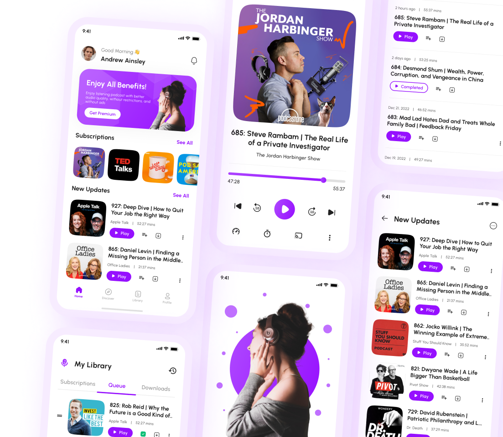

<div align="center">

<p></p>

# ktcast

### Open-Source Podcast App

[](https://www.android.com/)
[](https://www.android.com/)
[](https://kotlinlang.org)
[](https://developer.android.com/jetpack/compose)
[](./LICENSE)

----

Open-source podcast app written in Kotlin. In progress...

</div>

## Features

**In progress**

<br>

<p float="center">
  
</p>


## Technical Details

- **Jetpack Compose** 🚀

- **Multimodule Clean Architecture** 🏛

## Powered By

**In progress**

## Credits

**In progress**

## License

```
MIT License

Copyright (c) 2022 Nikita Zmitrovich

Permission is hereby granted, free of charge, to any person obtaining a copy
of this software and associated documentation files (the "Software"), to deal
in the Software without restriction, including without limitation the rights
to use, copy, modify, merge, publish, distribute, sublicense, and/or sell
copies of the Software, and to permit persons to whom the Software is
furnished to do so, subject to the following conditions:
```   
